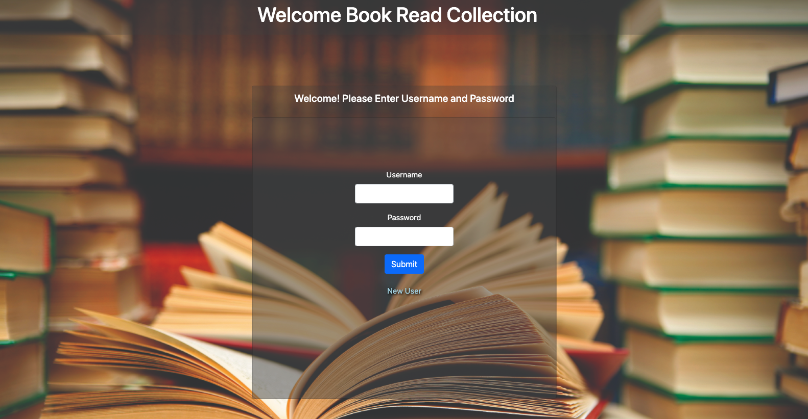
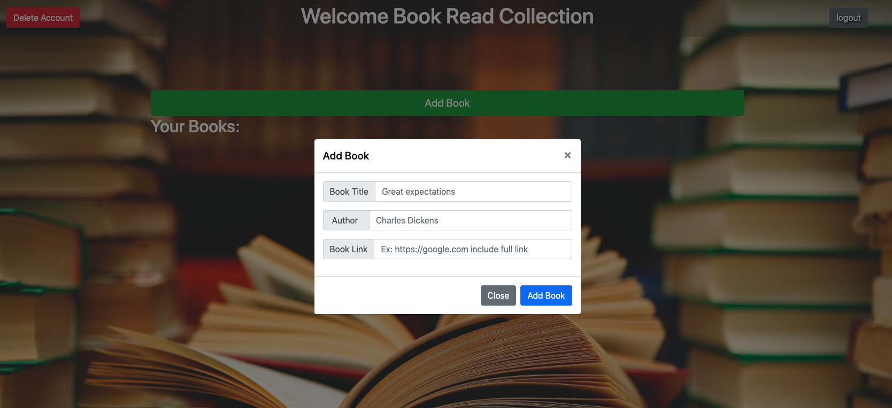
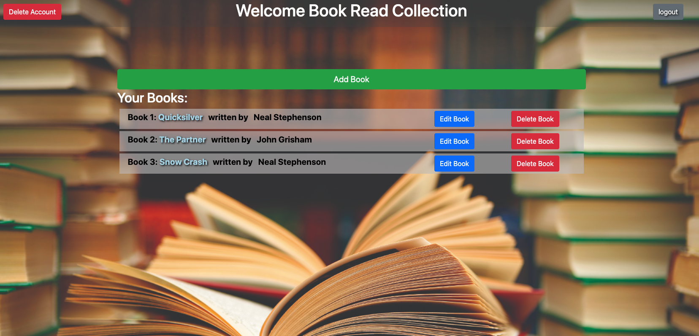

# Book Collection

 

## Live Application
link here

## Creator
Matt Wieciech  
Murad Alkaylanie  

#### Created On: 08/18/2020 

​   
​   
​   

## Description
A full stack application that allows a user track books that they read, add books to the list, and view others books.

## Table of Contents
* [Usage](#usage)
* [License](#license)
* [Questions](#questions)

## Usage
A user can create books for their reading list.

## License
This project is convered under the MIT License.

## Questions
For questions about this project, please see my GitHub at [wheaties5588](https://github.com/wheaties5588), or reach out by email at matt.wieciech@gmail.com.